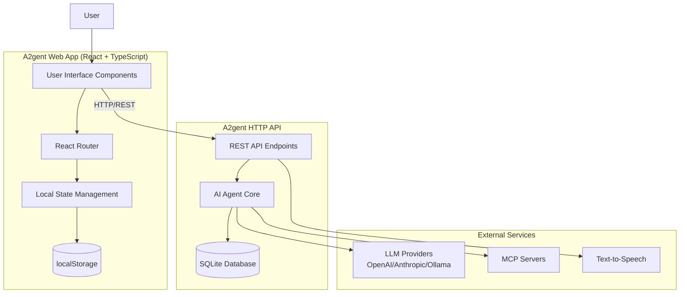
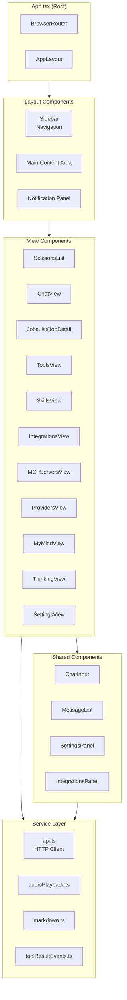
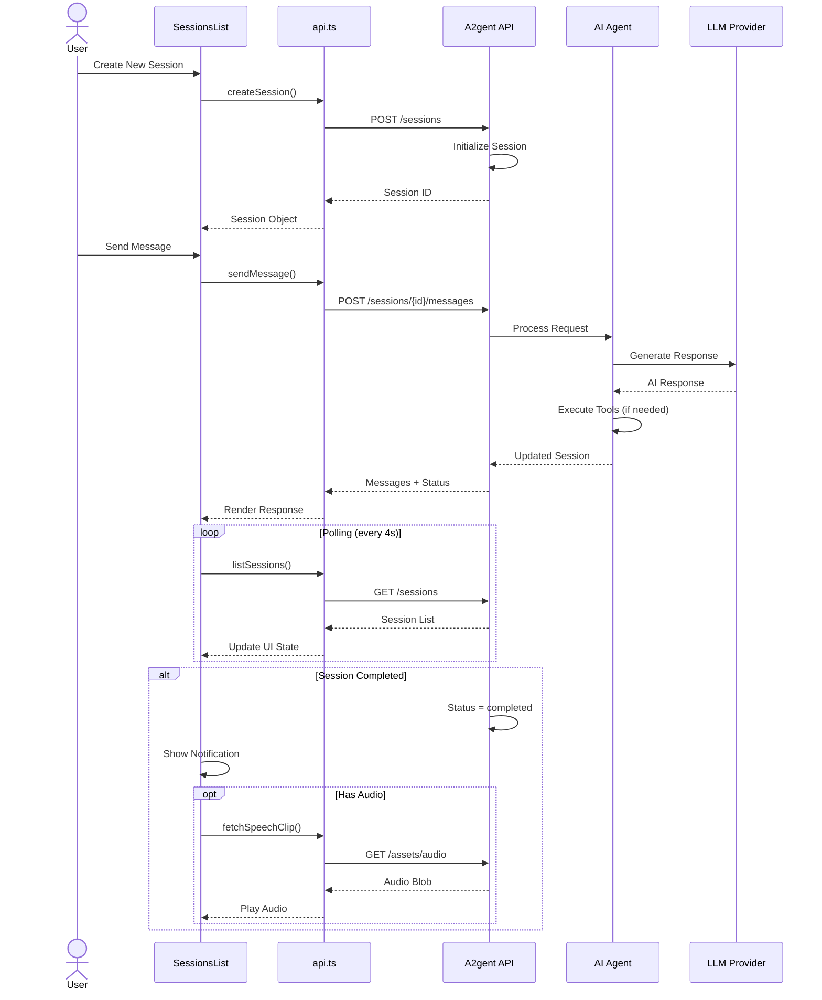
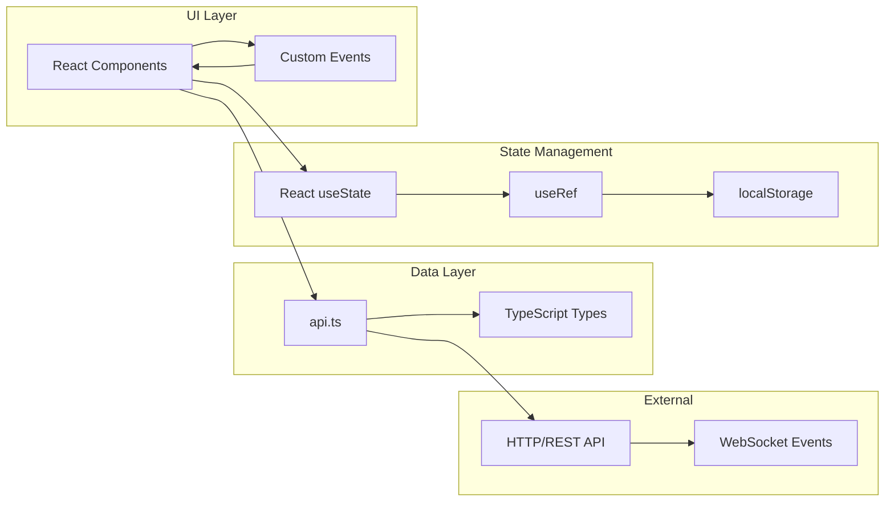

# 🏛️ A²gent/caesar 
> Et tu, Brute?

A personal AI agent control web app. Uses [A²gent/brute](https://github.com/A2gent/brute) terminal agent as a backend.

A modern, responsive web interface for managing AI agent sessions, jobs, tools, and knowledge base.
Main use-case is having personal knowledge base (Obsidian-style second brain) used by the persistent, self-improving AI agent.


## Features

### Core Features
- **My Mind** - Personal knowledge base and memory management. Navigate .md files, prompt in their context, use as reference for recurring jobs.


- **Voice Input** - Speech-to-text input support for hands-free interaction


- **Session Management** - Create, browse, and manage AI chat sessions with full conversation history
- **Real-time Chat** - Interactive chat interface with markdown rendering and streaming responses
- **Audio Playback** - Text-to-speech notifications with play/pause/stop controls
- **Mobile Responsive** - Adaptive layout with collapsible sidebar for mobile devices
- **Notification System** - Real-time notifications for session completion with audio alerts

### Agent Management
- **Jobs** - Schedule and monitor background agent tasks
- **Tools** - Browse and configure agent tools and capabilities


- **Skills** - Manage agent skills and specialized behaviors
- **Thinking Process** - Visualize agent reasoning and thought chains


### Integrations & Configuration
- **LLM Providers** - Configure multiple AI providers (OpenAI, Anthropic, Ollama, etc.)
- **MCP Servers** - Model Context Protocol server management
- **Integrations** - Third-party service integrations


### UI Features
- **Resizable Sidebar** - Draggable sidebar width with persistence
- **Theme Customization** - Customizable app title and branding
- **Keyboard Navigation** - Full keyboard accessibility support
- **Auto-refresh** - Real-time polling for session updates

## Architecture

### High-Level System Flow



### Component Architecture



### Session Lifecycle Flow



### Data Flow Architecture



## Project Structure

```
src/
├── App.tsx                 # Main application component with routing
├── api.ts                  # HTTP API client and data types
├── main.tsx               # Application entry point
├── global.d.ts            # Global TypeScript declarations
├── index.css              # Global styles
├── App.css                # Application-specific styles
│
├── Views (Page Components)
├── ChatView.tsx           # Chat interface
├── SessionsList.tsx       # Session management
├── JobsList.tsx           # Job listing
├── JobDetail.tsx          # Job details
├── JobEdit.tsx            # Job editing
├── ToolsView.tsx          # Tools management
├── SkillsView.tsx         # Skills configuration
├── IntegrationsView.tsx   # Integrations page
├── IntegrationsPanel.tsx  # Integration settings panel
├── MCPServersView.tsx     # MCP server management
├── ProvidersView.tsx      # LLM provider list
├── ProviderEditView.tsx   # Provider configuration
├── MyMindView.tsx         # Knowledge base
├── ThinkingView.tsx       # Thinking process visualization
├── SettingsView.tsx       # Settings page
├── SettingsPanel.tsx      # Reusable settings panel
├── FallbackAggregateCreateView.tsx  # Fallback provider creation
│
├── Shared Components
├── Sidebar.tsx            # Navigation sidebar
├── ChatInput.tsx          # Chat input with voice
├── MessageList.tsx        # Message rendering
├── InstructionBlocksEditor.tsx  # Instruction editor
│
├── Services/Utilities
├── audioPlayback.ts       # Audio playback utilities
├── markdown.ts           # Markdown processing
├── thinking.ts           # Thinking process utilities
├── skills.ts             # Skills data/types
├── toolIcons.ts          # Tool icon mappings
├── toolResultEvents.ts   # Tool result event handling
├── webappNotifications.ts # Notification system
├── myMindNavigation.ts   # Knowledge base navigation
├── instructionBlocks.ts  # Instruction block types
├── integrationMeta.tsx   # Integration metadata
└── assets/               # Static assets
    └── react.svg
```

## Data Models

### Core Types

```typescript
// Session
interface Session {
  id: string;
  title?: string;
  status: 'active' | 'completed' | 'failed' | 'pending';
  parent_id?: string;       // For session threading
  job_id?: string;          // Associated background job
  project_id?: string;      // Project grouping
  messages: Message[];
  created_at: string;
  updated_at: string;
}

// Message
interface Message {
  id: string;
  role: 'user' | 'assistant' | 'system';
  content: string;
  timestamp: string;
  tool_calls?: ToolCall[];
  tool_results?: ToolResult[];
}

// Job
interface Job {
  id: string;
  name: string;
  description?: string;
  schedule?: string;        // Cron expression
  status: 'active' | 'paused' | 'completed' | 'failed';
  last_run?: string;
  next_run?: string;
}

// Provider Configuration
interface ProviderConfig {
  id: string;
  type: 'openai' | 'anthropic' | 'ollama' | 'fallback-aggregate';
  name: string;
  api_key?: string;
  base_url?: string;
  model?: string;
  priority?: number;        // For fallback aggregates
}
```

## Development

```bash
# Install dependencies
npm install

# Start development server
npm run dev
```

Default dev URL: `http://localhost:5173`

Build and preview:

```bash
npm run build
npm run preview
```

## Backend API Configuration

By default the app connects to:
- `http://localhost:8080`

Override options:
- Build time: Set `VITE_API_URL` environment variable
- Runtime: Set via local storage key `a2gent.api_base_url`

## Available Scripts

- `npm run dev` - Start Vite development server with HMR
- `npm run build` - Type-check and build production assets
- `npm run lint` - Run ESLint for code quality
- `npm run preview` - Preview production build locally

## Session Architecture

### Session Grouping

Current implementation supports:
- **Parent-child relationships** via `parent_id` field
- **Job-associated sessions** via `job_id` field
- **Project isolation** via `project_id` field (e.g., `THINKING_PROJECT_ID`)

### Notification System

The app implements a polling-based notification system:
- Polls session status every 4 seconds
- Detects terminal states (`completed`, `failed`)
- Supports rich notifications with images and audio
- Auto-plays speech notifications when available

## Browser Support

- Chrome/Edge 90+
- Firefox 88+
- Safari 14+
- Mobile Safari/Chrome (iOS/Android)

## Tech Stack

- **Framework**: React 19.2.0
- **Language**: TypeScript 5.9.3
- **Router**: React Router DOM 7.13.0
- **Build Tool**: Vite 7.2.4
- **Linting**: ESLint 9.39.1 + typescript-eslint
- **Styling**: CSS Modules + Custom CSS Properties
